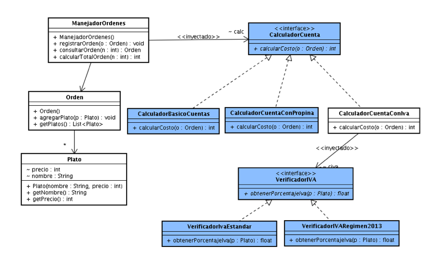

### Escuela Colombiana de Ingeniería

### Procesos de Desarrollo de Software

### Desarrollo Dirigido por Pruebas + DIP + DI + Contenedores Livianos

Se le ha pedido desarrollar un API para el cálculo de las cuentas de restaurantes de acuerdo con la normatividad Colombiana, el cual pueda ser integrado a aplicaciones POS (Point of Sale). La particularidad de este API es se espera que pueda ser aplicado en diferentes tipo de restaurantes, ya que éstos -muchas veces- interpretan y aplican las normas de manera diferente. En particular, se tienen -por ahora- los siguientes casos:

* En algunos restaurantes los precios de los platos ya incluirán el IVA (CalculadorBasicoCuentas) y no cobran propina. Es decir, la cuenta es simplemente la sumatoria de los precios.

* En otros restaurantes los precios ya incluyen el IVA, pero sí cobran el servicio del 10% sobre el total de la factura, siempre que el valor total de la misma supere los $15.000 pesos.(CalculadorCuentaConPropina).

* En muchos otros sí se cobra el IVA. Sin embargo, la manera de hacerlo varía de dos formas:
	* 19% estándar sobre todos los platos (CalcularodCuentaConIVA + VerificadorIVAEstandar).
	* Aplicando un IVA diferencial a cada tipo de plato, previendo el régimen especial de impuestos a las comidas del el año 2016, donde:
		* Las bebidas azucaradas (con más de 1000 calorías) tendrán un gravamen adicional del 10% (es decir, un gravamen del 29%).
		* Los demás platos tendrán el gravamen estándar del 19%.

Lo anterior, se traduce en el siguiente modelo, donde se aplica el principio de inversión de dependencias:





### Parte I

1. Clone el proyecto (no lo descargue!).
2. A partir del código existente, implemente sólo los cascarones del modelo antes indicado.

3. Haga la especificación de los métodos calcularCosto (de las tres variantes de CalculadorCuenta), a partir de las especificaciones generales dadas anteriormente. Recuerde tener en cuenta: @pre, @pos, @param, @throws.

4. Haga commit de lo realizado hasta ahora. Desde la terminal:

	```bash		
	git add .			
	git commit -m "especificación métodos"
	```

5. Teniendo en cuenta dichas especificaciones, en la clase donde se implementarán las pruebas (CalculadorCuentasTest), en los comentarios iniciales, especifique las clases de equivalencia para las tres variantes de calculador de cuenta, e identifique condiciones de frontera. Tenga presente que además de los parámetros de entrada, el resultado de dichas calculadoras (la que tiene en cuenta el IVA) dependerá de qué objetos de bajo nivel tendrá asociados.

6. Para cada clase de equivalencia y condición de frontera, implemente una prueba.

7. Haga commit de lo realizado hasta ahora. Desde la terminal:

	```bash		
	git add .			
	git commit -m "implementación pruebas"
	```
8. Realice los ciclos TDD que hagan falta para implementar los 'cascarones' realizados anteriormente: implementar, correr pruebas, agregar casos de prueba (si hace falta), refactorizar, ejecutar nuevamente las pruebas, etc.

9. Al finalizar haga un nuevo commit:

	```bash		
	git add .			
	git commit -m "implementación del modelo"
	```

10. Para comprimir el avance y NO PERDER el histórico de commits, use el siguiente comando (dentro del directorio que va a comprimir, sin olvidar el punto):

```bash	
	zip -r NOMBRE.PROYECTO.zip .	
```


### Parte II

Incorpore el Contenedor Liviano Guice dentro del proyecto:

* Agregue las dependencias necesarias en el pom.xml.
* Configure la aplicación de manera que desde el programa SimpleApp NO SE CONSTRUYA el manejador de órdenes directamente, sino a través de Guice, y que a través de la configuración de la Inyección de Dependencias se pueda cambiar el comportamiento del mismo, por ejemplo:
	* Calcular si IVA y sin propinas.
	* Calcular con el IVA del régimen del 2016.
	* Calcualr con el IVA unificado.
	* etc...
* Para lo anterior, [puede basarse en el ejemplo dado como referencia](https://github.com/PDSW-ECI/LightweighContainers_DepenendecyInjectionIntro-WordProcessor).